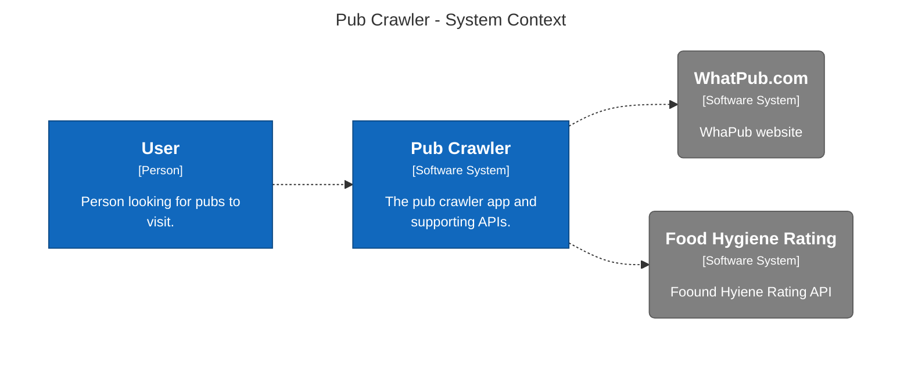
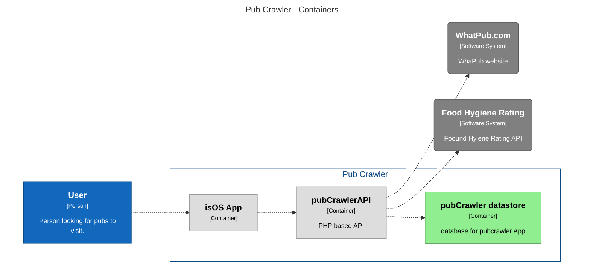
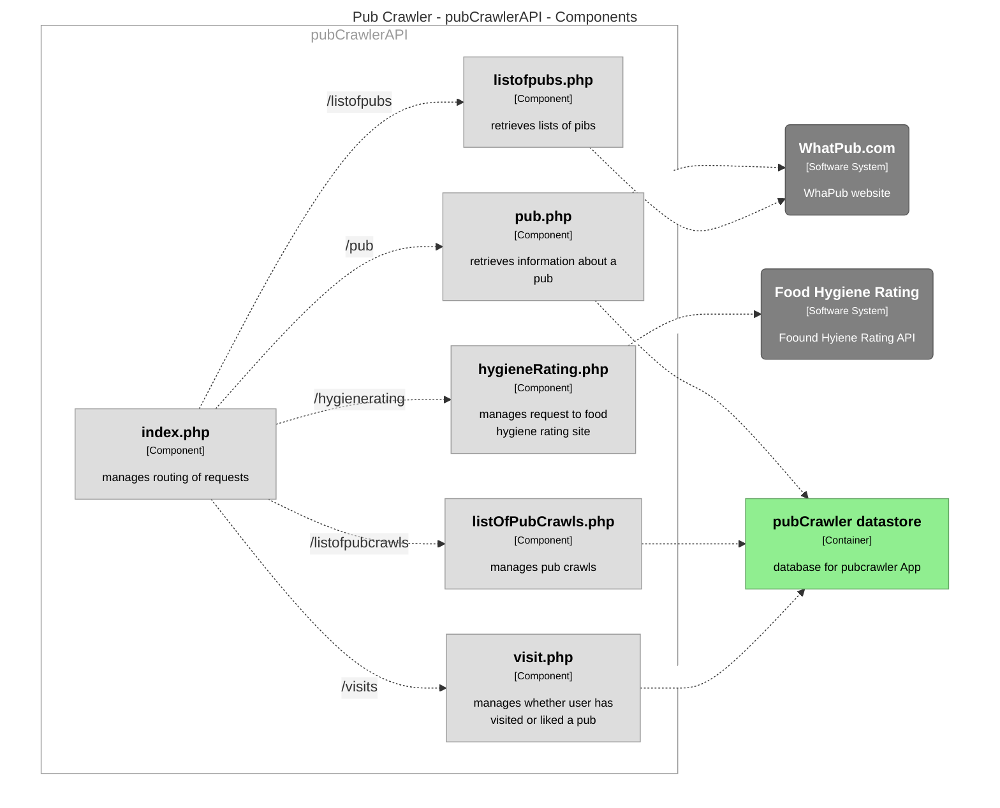

# PubCrawler
Pub Crawler iPhone App

```mermaid
graph TB
  linkStyle default fill:#ffffff

  subgraph diagram [Pub Crawler - System Context]
    style diagram fill:#ffffff,stroke:#ffffff

    1("<div style='font-weight: bold'>WhatPub.com</div><div style='font-size: 70%; margin-top: 0px'>[Software System]</div><div style='font-size: 80%; margin-top:10px'>WhaPub website</div>")
    style 1 fill:#808080,stroke:#595959,color:#ffffff
    2("<div style='font-weight: bold'>Food Hygiene Rating</div><div style='font-size: 70%; margin-top: 0px'>[Software System]</div><div style='font-size: 80%; margin-top:10px'>Foound Hyiene Rating API</div>")
    style 2 fill:#808080,stroke:#595959,color:#ffffff
    3["<div style='font-weight: bold'>Pub Crawler</div><div style='font-size: 70%; margin-top: 0px'>[Software System]</div><div style='font-size: 80%; margin-top:10px'>The pub crawler app and<br />supporting APIs.</div>"]
    style 3 fill:#1168bd,stroke:#0b4884,color:#ffffff
    33["<div style='font-weight: bold'>User</div><div style='font-size: 70%; margin-top: 0px'>[Person]</div><div style='font-size: 80%; margin-top:10px'>Person looking for pubs to<br />visit.</div>"]
    style 33 fill:#1168bd,stroke:#0b4884,color:#ffffff

    3-. "<div></div><div style='font-size: 70%'></div>" .->1
    3-. "<div></div><div style='font-size: 70%'></div>" .->2
    33-. "<div></div><div style='font-size: 70%'></div>" .->3
  end
```

```mermaid
graph TB
  linkStyle default fill:#ffffff

  subgraph diagram [Pub Crawler - Containers]
    style diagram fill:#ffffff,stroke:#ffffff

    33["<div style='font-weight: bold'>User</div><div style='font-size: 70%; margin-top: 0px'>[Person]</div><div style='font-size: 80%; margin-top:10px'>Person looking for pubs to<br />visit.</div>"]
    style 33 fill:#1168bd,stroke:#0b4884,color:#ffffff
    1("<div style='font-weight: bold'>WhatPub.com</div><div style='font-size: 70%; margin-top: 0px'>[Software System]</div><div style='font-size: 80%; margin-top:10px'>WhaPub website</div>")
    style 1 fill:#808080,stroke:#595959,color:#ffffff
    2("<div style='font-weight: bold'>Food Hygiene Rating</div><div style='font-size: 70%; margin-top: 0px'>[Software System]</div><div style='font-size: 80%; margin-top:10px'>Foound Hyiene Rating API</div>")
    style 2 fill:#808080,stroke:#595959,color:#ffffff

    subgraph 3 [Pub Crawler]
      style 3 fill:#ffffff,stroke:#0b4884,color:#0b4884

      31["<div style='font-weight: bold'>isOS App</div><div style='font-size: 70%; margin-top: 0px'>[Container]</div>"]
      style 31 fill:#dddddd,stroke:#9a9a9a,color:#000000
      4["<div style='font-weight: bold'>pubCrawler datastore</div><div style='font-size: 70%; margin-top: 0px'>[Container]</div><div style='font-size: 80%; margin-top:10px'>database for pubcrawler App</div>"]
      style 4 fill:#90ee90,stroke:#64a664,color:#000000
      8["<div style='font-weight: bold'>pubCrawlerAPI</div><div style='font-size: 70%; margin-top: 0px'>[Container]</div><div style='font-size: 80%; margin-top:10px'>PHP based API</div>"]
      style 8 fill:#dddddd,stroke:#9a9a9a,color:#000000
    end

    8-. "<div></div><div style='font-size: 70%'></div>" .->1
    8-. "<div></div><div style='font-size: 70%'></div>" .->4
    8-. "<div></div><div style='font-size: 70%'></div>" .->2
    31-. "<div></div><div style='font-size: 70%'></div>" .->8
    33-. "<div></div><div style='font-size: 70%'></div>" .->31
  end
```

```mermaid
graph TB
  linkStyle default fill:#ffffff

  subgraph diagram [Pub Crawler - pubCrawlerAPI - Components]
    style diagram fill:#ffffff,stroke:#ffffff

    1("<div style='font-weight: bold'>WhatPub.com</div><div style='font-size: 70%; margin-top: 0px'>[Software System]</div><div style='font-size: 80%; margin-top:10px'>WhaPub website</div>")
    style 1 fill:#808080,stroke:#595959,color:#ffffff
    2("<div style='font-weight: bold'>Food Hygiene Rating</div><div style='font-size: 70%; margin-top: 0px'>[Software System]</div><div style='font-size: 80%; margin-top:10px'>Foound Hyiene Rating API</div>")
    style 2 fill:#808080,stroke:#595959,color:#ffffff
    4["<div style='font-weight: bold'>pubCrawler datastore</div><div style='font-size: 70%; margin-top: 0px'>[Container]</div><div style='font-size: 80%; margin-top:10px'>database for pubcrawler App</div>"]
    style 4 fill:#90ee90,stroke:#64a664,color:#000000

    subgraph 8 [pubCrawlerAPI]
      style 8 fill:#ffffff,stroke:#9a9a9a,color:#9a9a9a

      15["<div style='font-weight: bold'>listofpubs.php</div><div style='font-size: 70%; margin-top: 0px'>[Component]</div><div style='font-size: 80%; margin-top:10px'>retrieves lists of pibs</div>"]
      style 15 fill:#dddddd,stroke:#9a9a9a,color:#000000
      17["<div style='font-weight: bold'>listOfPubCrawls.php</div><div style='font-size: 70%; margin-top: 0px'>[Component]</div><div style='font-size: 80%; margin-top:10px'>manages pub crawls</div>"]
      style 17 fill:#dddddd,stroke:#9a9a9a,color:#000000
      19["<div style='font-weight: bold'>hygieneRating.php</div><div style='font-size: 70%; margin-top: 0px'>[Component]</div><div style='font-size: 80%; margin-top:10px'>manages request to food<br />hygiene rating site</div>"]
      style 19 fill:#dddddd,stroke:#9a9a9a,color:#000000
      23["<div style='font-weight: bold'>visit.php</div><div style='font-size: 70%; margin-top: 0px'>[Component]</div><div style='font-size: 80%; margin-top:10px'>manages whether user has<br />visited or liked a pub</div>"]
      style 23 fill:#dddddd,stroke:#9a9a9a,color:#000000
      25["<div style='font-weight: bold'>index.php</div><div style='font-size: 70%; margin-top: 0px'>[Component]</div><div style='font-size: 80%; margin-top:10px'>manages routing of requests</div>"]
      style 25 fill:#dddddd,stroke:#9a9a9a,color:#000000
      9["<div style='font-weight: bold'>pub.php</div><div style='font-size: 70%; margin-top: 0px'>[Component]</div><div style='font-size: 80%; margin-top:10px'>retrieves information about a<br />pub</div>"]
      style 9 fill:#dddddd,stroke:#9a9a9a,color:#000000
    end

    9-. "<div></div><div style='font-size: 70%'></div>" .->1
    9-. "<div></div><div style='font-size: 70%'></div>" .->4
    15-. "<div></div><div style='font-size: 70%'></div>" .->1
    17-. "<div></div><div style='font-size: 70%'></div>" .->4
    19-. "<div></div><div style='font-size: 70%'></div>" .->2
    23-. "<div></div><div style='font-size: 70%'></div>" .->4
    25-. "<div>/pub</div><div style='font-size: 70%'></div>" .->9
    25-. "<div>/listofpubs</div><div style='font-size: 70%'></div>" .->15
    25-. "<div>/listofpubcrawls</div><div style='font-size: 70%'></div>" .->17
    25-. "<div>/hygienerating</div><div style='font-size: 70%'></div>" .->19
    25-. "<div>/visits</div><div style='font-size: 70%'></div>" .->23
  end
```
